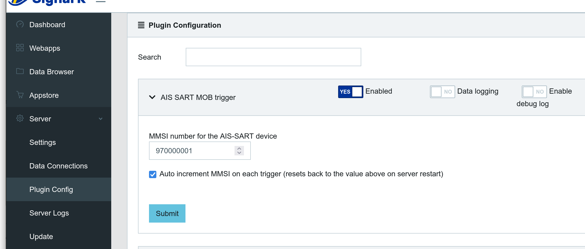
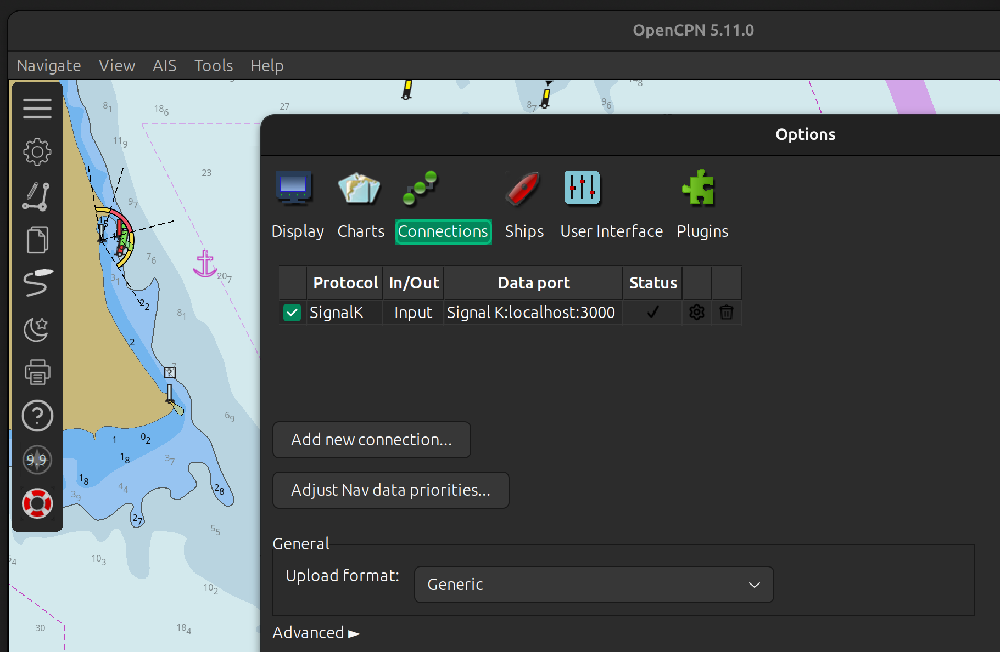
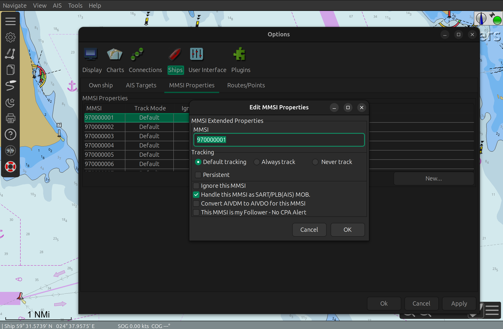

# signalk-ais-sart-opencpn-mob-plugin
A SignalK plugin that simulates an AIS SART (Search and Rescue Transponder) MOB (Man Overboard) event via a REST endpoint trigger. Designed for integration with OpenCPN’s MOB alert system — ideal for triggering MOB scenarios from other apps or systems.

### Configuration

#### SignalK

Make sure plugin is installed and enabled in the Plugin Config section of SignalK



#### OpenCPN

OpenCPN is required to have SignalK connection configured



then configure MMSIs as described in the OpenCPN manual [MOB activated automatically](https://mail.opencpn.org/wiki/dokuwiki/doku.php?id=opencpn:manual_basic:mob#mob_activated_automatically)



### Example usage

```shell
curl -XPOST http://localhost:3000/plugins/signalk-ais-sart-opencpn-mob-plugin/trigger
```

